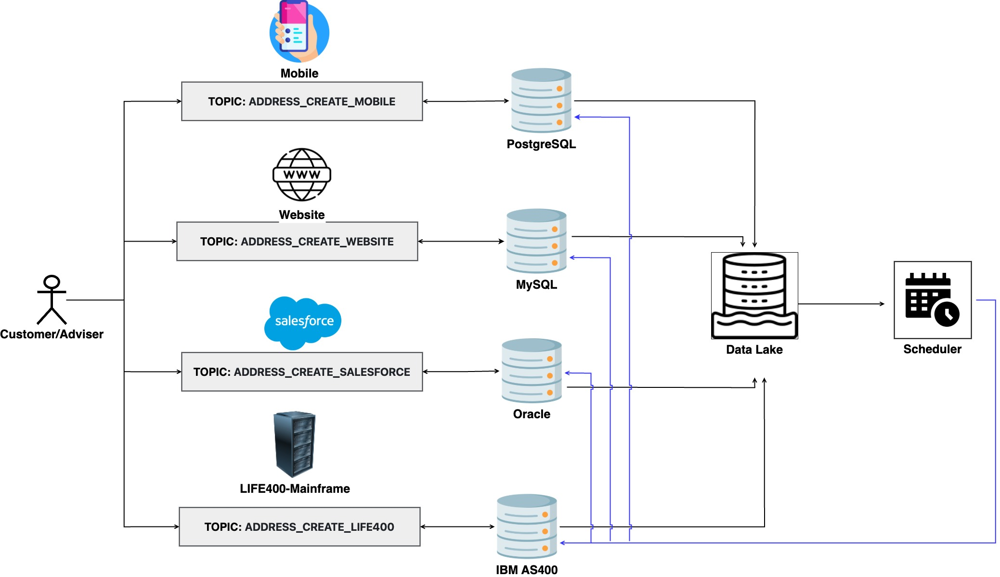
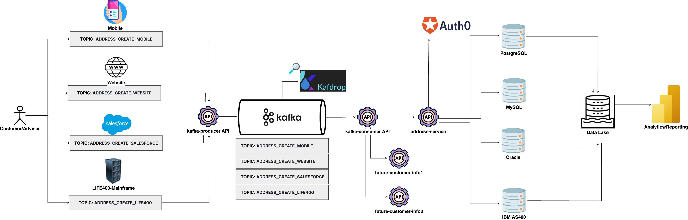
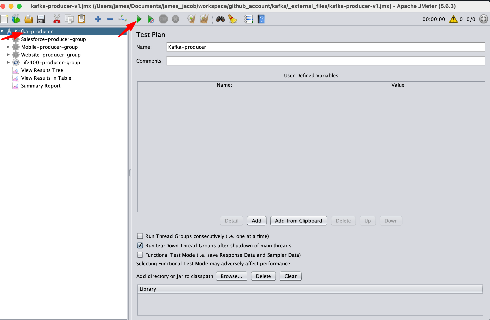
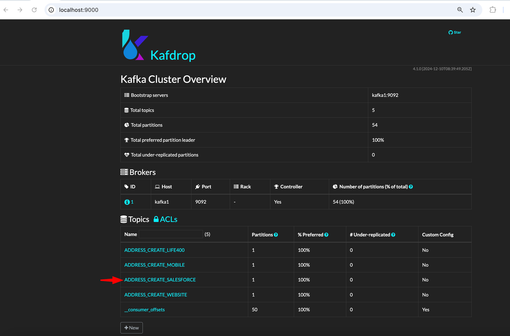
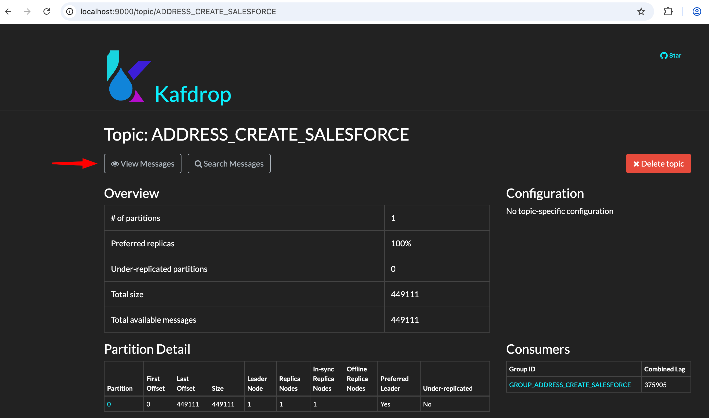
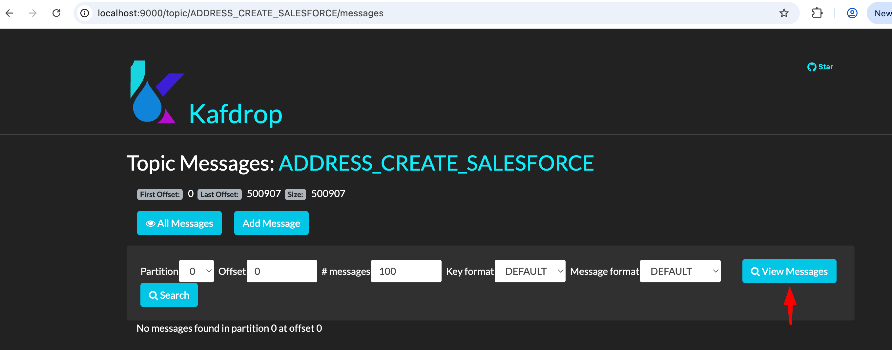
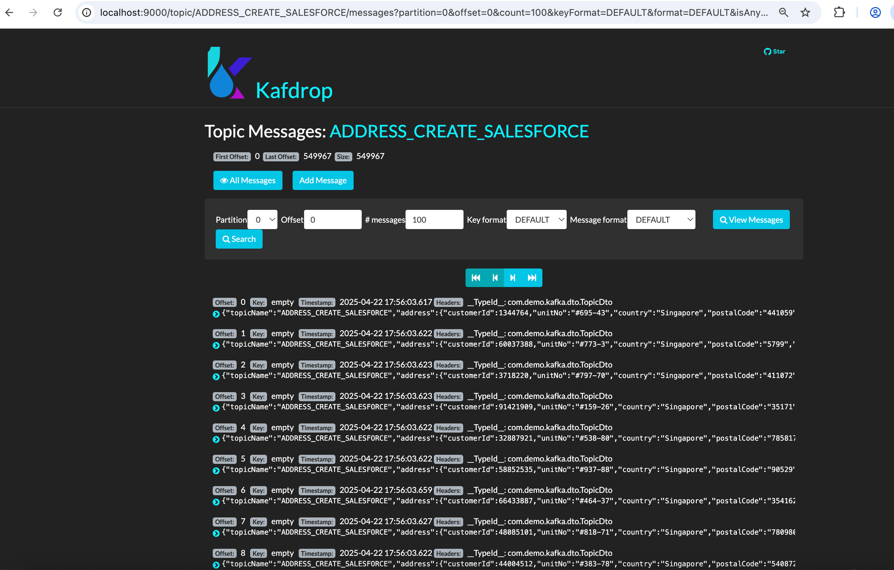
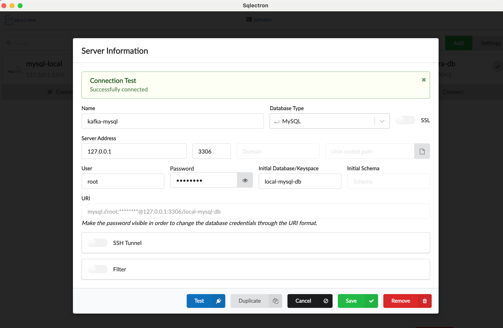
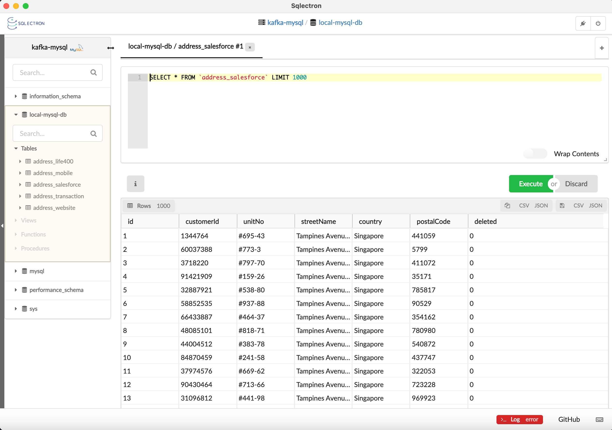

# Spring Boot, Kafka, Zookeeper, Kafdrop, Spring Data/JPA, MySQL, Rest API
## Sample kafka-project

### Problem statements assumptions(Insurance domain)
* In insurance domain, usually, there are multiple platforms/applications responsible in updating customer information such as:
  * Address
  * Marketing preferences
* Customer data from different platforms/applications are sometimes bound to a specific database based on provided customer consent.
* All application data are consolidated into a common central data lake, but it usually comes with a T-1 day synchronization delay.
* <u><b>How to lessen the refresh period from the central data lake back to multiple sources(platforms/applications)?</b></u>

### Note: The data lake was introduced for visualization purposes only. It is not going to be part of our solution.

#### Refer to the sample common insurance domain high-level architecture diagram:


### Sample use Case(Address creation)
* Improve the speed of synchronizing customer information in a typical Insurance domain.
* In the Insurance domain, there are multiple platforms/applications that can update customer information like customer address
These sample applications are as follows:
  * Mobile app
  * Website app(Customer/Adviser portal)
  * Identity Provider(Auth0, Okta, Keycloak)
  * Salesforce
  * Life400 - mainframe
* Kafka producers(insurance platforms) to initiate ADDRESS creation
* Kafka consumer to perform eventual consistent update to each platform databases.
  * Execute real-time update to individual platforms:
    * Mobile app - address_mobile
    * Website app - address_website
    * Salesforce - address_salesforce
    * Life400 - address_life400
  * Execute almost real-time update to core services like Policy Admin Systems like As400, Life Asia and Life400.
* Introduced <b>address_transaction table</b> which will be referred by the other consumers like analytics reporting for marketing purposes.

### Solution:
* One of the workaround is to create a process that will:
  * Update the customer information to all real-time systems like Mobile App, Web application, Identity Provider(Auth0, Okta, Keycloak), etc.
  * Update the core systems like Policy Admin Systems(AS400, Life Asia and Life400) to almost real-time.
* Kafka as traditional message broker.
  * One topic per platform
    * ADDRESS_CREATE_SALESFORCE
    * ADDRESS_CREATE_MOBILE
    * ADDRESS_CREATE_WEBSITE
    * ADDRESS_CREATE_LIFE400
  * <u><b>Note: The below number of microservice instance can be scaled up horizontally in actual Production environment.</b></u>
    * One producer endpoint to all platforms and topics.
    * One consumer listener per platform/topic.
    * One address-service endpoint to all platforms and topics.

#### Sample future state high-level architecture diagram:
  

### Prerequisites on running this project:
- Install Java 21(Min of Java 11, needed by Kafkdrop - kafka message viewer).
- Install Docker Desktop.
- JMeter - for testing.

### Tech stack and services in kafka-project.
- kafka
- zookeeper
- Kafkdrop - kafka message viewer
- kafka-producer service
- kafka-consumer service
- address-service - services to process consume messages
- MySql - to save all platform transactions in separate tables

### Steps in running kafka-project.
- Checkout the project in Github.
- Go the project directory.
```bash
cd /<path>/kafka-project
```
- Install kafka-project services.
```bash
mvn clean install
```
- Start kafka-project services.
```bash
docker-compose up
```
- View Kafdrop on the browser using the below URL.
```bash
http://localhost:9000
```

### Testing kafka-project locally.
- Copy the JMeter script to JMeter bin directory.
```bash
JMeter script - kafka-project/_external_files/kafka-producer-v1.jmx
JMeter bin - <JMeter path>/bin
cp <JMeter script> <JMeter bin>
```
- Open JMeter interface.
```bash
cd <JMeter bin>
./jmeter.sh
```
- Execute JMeter script.
```bash
Click the Test Plan from the left side red arrow.
Click the Start button from the right side red arrow.
```
- <b>Note: This will execute a <u>total number of 4,000 concurrent requests</u> as follows:
  - Salesforce - 1,000 concurrent requests/minute
  - Mobile - 1,000 concurrent requests/minute
  - Website - 1,000 concurrent requests/minute
  - Life400 - 1,000 concurrent requests/minute
  </b>
- 

### View Kafka messages using Kafdrop.
- 
- 
- 
- 
- 
- 
- 

### View the address records.
- Setup MySQL client.
- 
- Verify the data.
- 